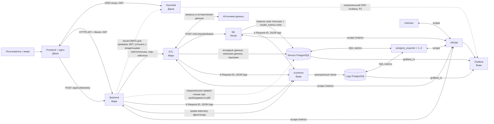

# MosTransport hack26 — DB и observability

README этой ветки — обязательная рабочая карта состава инфраструктуры и всех стыковок между зонами команды. Каждая связь фиксируется здесь в диаграмме и/или таблице интерфейсов: стороны и владельцы, протокол/endpoint или таблицы, auth и request ID, внутренний/публикуемый порт, env, healthcheck, метрики/логи, запуск и способ проверки. Неизвестное помечается `TBD` с ответственным за уточнение; значения не угадываются. README обновляется в том же цельном блоке, что и соответствующая реализация или изменение контракта, а готовый блок проходит проверку пользователя до push.

## 1. Рабочая зона и текущее состояние

- Рабочая ВМ: `/home/aristarkhshavreev/MosTransport_hack26_db_observability`.
- Рабочая ветка: `db-observability-vova`.
- Владелец зоны DB, логов, мониторинга и инфраструктурной документации: Вова.
- На общей ВМ установлены Docker Engine 29.8.1, Compose plugin 5.5.1 и Buildx 0.37.1; служба Docker активна.
- Docker доступен через `sudo`; пользователь не добавлен в группу `docker`.
- В корне ветки пока нет общего `docker-compose.yml` и корневого `.env.example`; сервисный код коллег ещё не получен. Самостоятельный модуль Logs DB с SQL, ролями, retention и тестовым Compose находится в `infra/db/logs/`; подключение к общему стеку и сервисная БД — следующие интеграционные блоки.

Перед любой работой на ВМ проверьте папку, ветку и рабочее дерево:

```bash
cd /home/aristarkhshavreev/MosTransport_hack26_db_observability
pwd
git branch --show-current
git status
```

Ожидаются указанные выше папка и ветка. Не трогайте чужие рабочие копии и ветки, не меняйте `main`. Общесерверные настройки и опубликованные порты согласовываются с командой. Push возможен только после явного разрешения на конкретную отправку и только в `origin/db-observability-vova`. Полный порядок — в [WORKING_RULES.md](docs/db-observability/WORKING_RULES.md).

## 2. Владельцы компонентов и состав целевого стека

| Компонент | Владелец | Назначение | Состояние в этой ветке |
| --- | --- | --- | --- |
| Frontend + nginx | Даша | интерфейс карты и вызовы публичного API | внешний компонент, Dockerfile/порт ещё не получены |
| Keycloak | Даша | локальный dev-режим, импорт realm и демо-вход с выдачей JWT для жюри | внешний компонент, realm/клиент ещё не получены |
| Backend | Марк | публичное API, коэффициенты, экспорт, проксирование запросов | внешний компонент, контракты ниже согласованы |
| ETL | Марк | загрузка и нормализация данных, внешние признаки, подготовка прогнозов | внешний компонент, внутреннее API ниже согласовано |
| ML | Артур | обучение и пакетные/онлайн прогнозы | внешний компонент, внутреннее API ниже согласовано |
| PostgreSQL, сервисная БД | Вова | исходные данные, признаки, прогнозы и агрегаты | ещё не реализована |
| PostgreSQL, база логов | Вова | централизованные логи сервисов | самостоятельный модуль со схемой, ролями, очисткой, Compose и runbook реализован; в общий Compose ещё не встроен |
| Prometheus | Вова | сбор и правила метрик | ещё не реализован |
| Grafana | Вова | дашборды по метрикам, данным и логам | ещё не реализована |
| Экспортёры PostgreSQL и cAdvisor | Вова | метрики БД и ресурсов контейнеров | ещё не реализованы |
| `/common` | Вова | общий Python-модуль логов, request ID и HTTP-метрик | ещё не реализован |
| k6 | Вова | воспроизводимый нагрузочный тест | ещё не реализован |

Целевой Compose включает frontend, Keycloak, backend, ETL, ML, PostgreSQL (сервисная и логическая база логов), Prometheus, Grafana, экспортеры и нагрузочный сервис по мере готовности компонентов. До добавления `docker-compose.yml` точный набор контейнеров и способ размещения двух баз PostgreSQL остаются не реализованными решениями. Общая договорённость допускает два PostgreSQL-контейнера или один контейнер с двумя базами.

Базовые требования к Compose: healthcheck для каждого сервиса, `restart: unless-stopped`, зависимости с `condition: service_healthy` там, где сервис действительно ждёт другую службу, и постоянные volumes для PostgreSQL, Prometheus и Grafana. Только frontend, Grafana и Keycloak публикуются на ВМ после согласования host-портов; БД, ETL и ML доступны только внутри Docker-сети. Для Backend обязательны ограничения `cpus: "2"`, `memory: 2g`, `memswap_limit: 2g` (swap не использовать); ограничения остальных контейнеров подбираются так, чтобы стек помещался на ноутбуке жюри.

## 3. Карта связей между сервисами

Диаграмма показывает согласованные связи, которые нужно перенести в Compose, конфигурацию и README по мере реализации. Стрелки означают зависимость/обмен, а не уже работающие контейнеры.



Принцип горячего пути: ETL обновляет исторические и внешние данные и заранее готовит пакетные прогнозы; Backend отдаёт готовые результаты. Модель вызывается онлайн только при отсутствии прогноза. Frontend никогда не подключается к PostgreSQL напрямую: браузерная телеметрия идёт через `POST /api/v1/telemetry` в Backend.

### 3.1. Таблица интерфейсов и зависимостей

| Откуда → куда | Интерфейс / данные | Владелец связи | Статус и проверка |
| --- | --- | --- | --- |
| Frontend → Keycloak | OIDC login, клиент и `realm-export.json`, выдача JWT | Даша | realm/redirect URI и порт нужно зафиксировать; проверка входом демо-учёткой |
| Frontend → Backend | публичные `/api/v1/...`; `Authorization: Bearer <JWT>` кроме `/health/*` и `/metrics` | Даша + Марк | контракт согласован, код ещё не подключён; проверка `/docs` и сценария UI |
| Backend ↔ Keycloak | Backend принимает JWT, выданный Keycloak; issuer/JWKS/discovery URL и кэширование ключей | Марк + Даша | способ проверки токена и внутренняя ссылка на Keycloak должны быть зафиксированы в backend env/OpenAPI документации |
| Frontend → Backend → Logs DB | `POST /api/v1/telemetry`; frontend не пишет в PostgreSQL | Даша + Марк + Вова | контракт согласован; проверить появление записи в Grafana по `request_id` |
| Backend → ETL | `GET /etl/v1/forecast`, `/forecast/map`, `/reference/routes`, `/reference/stops`, `/reference/geometry` | Марк | контракт согласован; точные query-параметры и имя Compose-сервиса ещё нужно зафиксировать |
| ETL → внешние источники | исторические данные датасета, погода, трафик, календарь и события | Марк; признаки/интеграция согласуются с Артуром | конкретные источники и рабочие ссылки ещё не внесены; добавлять их в README при выборе |
| ETL → ML | `POST /ml/v1/predict`, `POST /ml/v1/predict/batch`; `GET /ml/v1/model/info` | Марк + Артур | контракт согласован; имя сервиса, payload и готовность к запуску должны быть подтверждены Dockerfile/`/docs` |
| ETL → Service DB | `validations`, `schedule`, `telematics`, `ext_*`, `features_hourly`; обновление справочников | Марк + Вова | схема согласована на уровне таблиц; миграции и права ещё не реализованы |
| ML ↔ Service DB | ML читает признаки; пишет `forecast_runs`, `forecasts`, `model_metrics` | Артур + Вова | схема/направление согласованы; миграции и учётная роль ещё не реализованы |
| Backend → Service DB | прямое чтение готовых прогнозов — только если потребуется для горячего пути | Марк + Вова | опциональный путь; включать после измерения p95 и согласования прав `backend_ro` |
| Backend/ETL/ML → Logs DB | JSON в stdout и асинхронные пачки через `/common`; `X-Request-ID` проходит по цепочке | владельцы сервисов + Вова | автономная Logs DB и retention-связь реализованы в `infra/db/logs/compose.yaml`; `/common` и интеграция в общий Compose ещё не реализованы |
| Prometheus → Backend/ETL/ML | scrape `GET /metrics` каждые 5–15 секунд; метрики отдаются сервисами в формате Prometheus | владельцы сервисов + Вова | требуется endpoint и targets Prometheus; конфиг ещё не создан |
| Prometheus → PostgreSQL exporters | `postgres_exporter` собирает метрики сервисной и логической БД | Вова | ещё не реализовано; порт экспортера только внутри Compose-сети |
| Prometheus → cAdvisor | scrape CPU, память, swap и состояние контейнеров | Вова | ещё не реализовано; наружу порт не публиковать |
| Prometheus + Service DB + Logs DB → Grafana | Prometheus datasource и PostgreSQL read-only datasources | Вова | provisioning и дашборды ещё не созданы; учётные данные только через `.env` |
| Keycloak → Grafana | generic OAuth для Grafana, P2; до этого отдельный администратор Grafana | Даша + Вова | клиент realm нужно согласовать; не блокирует P0 дашборды |

Каждое `ещё не реализовано` снимается только после добавления кода/конфигурации и проверяемого результата. При изменении контракта исправляются одновременно таблица, диаграмма и документация затронутого сервиса.

Для любой новой или изменённой строки этой матрицы явно фиксировать обе стороны и владельцев, endpoint/protocol и данные, auth/`X-Request-ID`, внутренний сервис/порт и host-публикацию, env names без секретных значений, startup dependency, healthcheck, метрики/логи, статус и проверочную команду/сценарий. Пока параметр не согласован, писать `TBD`, владельца и шаг уточнения; не подставлять догадки.

## 4. API-контракты

Все Python/FastAPI сервисы публикуют OpenAPI `/docs` во внутренней сети. Для всех запросов используется `X-Request-ID`: Frontend генерирует UUID, сервисы передают его дальше; если заголовка нет, его создаёт принимающий сервис.

### Frontend → Backend — публичный API

| Метод и путь | Назначение |
| --- | --- |
| `GET /api/v1/routes` | список маршрутов |
| `GET /api/v1/routes/{route_id}/stops` | остановки маршрута по направлениям и порядку |
| `GET /api/v1/routes/{route_id}/geometry` | GeoJSON геометрии маршрута |
| `GET /api/v1/forecast` | прогноз по горизонту/датам/маршруту/остановке/участку и коэффициентам |
| `GET /api/v1/forecast/map` | значения остановок для карты на заданный час |
| `GET /api/v1/forecast/export` | экспорт того же прогноза в `csv` или `xlsx` |
| `GET /api/v1/factors` | внешние факторы, источники и пресеты коэффициентов |
| `GET /api/v1/model/info` | версия модели, WAPE и область применимости |
| `POST /api/v1/telemetry` | приём браузерных логов/метрик Backend-ом для Logs DB |

`GET /api/v1/forecast` требует `horizon=day|month|year` и `date_from`, `date_to`; дополнительно принимает `route_id`, `stop_id`, границы участка, время суток, `group_by` и `k_weather`, `k_event`, `k_season`, `k_traffic`. Коэффициенты ограничены диапазоном 0.5–1.5 и по умолчанию равны 1.0. Backend применяет их к готовому прогнозу: `value_adj = value × k_weather × k_event × k_season × k_traffic`.

### Backend → ETL — внутреннее API

| Метод и путь | Назначение |
| --- | --- |
| `GET /etl/v1/forecast` | чтение и агрегация заранее подготовленных прогнозов |
| `GET /etl/v1/forecast/map` | значения остановок для карты на заданный час |
| `GET /etl/v1/reference/routes`, `/stops`, `/geometry` | справочники и геометрия |
| `POST /etl/v1/ingest` | идемпотентная загрузка `dataset.zip` |
| `POST /etl/v1/external/refresh` | обновление внешних данных |
| `POST /etl/v1/forecast/precompute` | подготовка признаков и пакетного прогноза |
| `POST /etl/v1/validations/stream` | поток валидаций пачками, если потребуется |

### ETL → ML — внутреннее API

| Метод и путь | Назначение |
| --- | --- |
| `POST /ml/v1/predict` | онлайн прогноз для выбранного периода и маршрутов |
| `POST /ml/v1/predict/batch` | пакетный прогноз по маршрутам и остановкам с записью результата в БД |
| `GET /ml/v1/model/info` | версия, дата обучения, WAPE по горизонтам и область применимости |

Единый формат ошибки: `error.code`, русскоязычный `error.message`, `error.details`, `error.request_id`. Ожидаемые HTTP-коды: 400, 401, 403, 404, 422, 503 и 504. Точные схемы request/response должны оставаться согласованными в OpenAPI трёх сервисов.

## 5. Данные, таблицы и права

Сервисная PostgreSQL — база продукта; Logs PostgreSQL — отдельная логическая база/сервис для наблюдаемости. Решение об одном или двух контейнерах фиксируется в Compose после проверки лимита памяти ВМ.

| Набор | Таблицы/объекты | Кто пишет / читает |
| --- | --- | --- |
| Справочники | `routes`, `stops`, `route_stops`, `route_geometry` | ETL пишет; Backend/Frontend читает через API |
| Нормализованные источники | `validations` (партиционирование по месяцам), `schedule`, `telematics` | ETL пишет; ML читает нужные признаки |
| Целевая величина | `target_hourly(route_id, stop_id, ts_hour, passengers)` | ETL пишет; ML читает |
| Внешние данные | `ext_weather_hourly`, `ext_traffic_hourly`, `ext_calendar_days`, `ext_events` (`source`, `fetched_at`) | ETL пишет; ML читает |
| Признаки | `features_hourly` | ETL пишет; ML читает |
| Прогнозы и качество | `forecast_runs`, `forecasts`, `model_metrics` | ML пишет; Backend/ETL/Grafana читают по выданным правам |
| Быстрые агрегаты | `mv_forecast_route_hour`, `mv_forecast_stop_hour`, `mv_forecast_route_day`, `mv_forecast_route_month`, `mv_forecast_map_hour` | Вова поддерживает миграции; ETL обновляет; Backend/ETL читают |
| Логи | `logs` (`ts`, `service`, `level`, `request_id`, `user_id`, `event`, `message`, `method`, `path`, `status`, `latency_ms`, `payload jsonb`) | `/common` пишет асинхронно; Grafana читает |

Минимальные роли: `etl_rw` пишет исходные/внешние данные и признаки, читает прогнозы; `ml_rw` читает признаки и пишет прогнозы/качество; `logs_writer` только вставляет логи; `grafana_ro` только читает. `backend_ro` создаётся лишь при включении прямого чтения Backend-ом. Время хранится как `timestamptz`, отображается в `Europe/Moscow`; `route_id` и `stop_id` приходят из общего справочника. Изменения схемы оформляются SQL-миграциями в `infra/db/service/`.

### 5.1. Logs DB: схема, доступ и очистка

Контракт полей взят из раздела 4.2 общих договорённостей; SQL-реализация находится в `infra/db/logs/001_logs_schema.sql`.

| Поле | PostgreSQL | Обязательность и источник |
| --- | --- | --- |
| `ts` | `timestamptz` | обязательно; время события, по умолчанию текущее |
| `service` | `text` | обязательно; `backend`, `etl`, `ml` или `frontend` |
| `level` | `text` | обязательно; `DEBUG`, `INFO`, `WARNING` или `ERROR` |
| `request_id` | `uuid` | обязательно; переданный `X-Request-ID` или созданный принимающим сервисом |
| `user_id` | `text` | необязательно; идентификатор пользователя из JWT, если есть |
| `event` | `text` | обязательно; короткий код события |
| `message` | `text` | обязательно; описание события |
| `method` | `text` | необязательно; HTTP-метод |
| `path` | `text` | необязательно; путь без секретных query-параметров |
| `status` | `integer` | необязательно; HTTP-код 100–599 |
| `latency_ms` | `double precision` | необязательно; длительность неотрицательная, в миллисекундах |
| `payload` | `jsonb` | обязательно; по умолчанию пустой объект `{}`; не помещать секреты и токены |

Прикладных колонок сверх этого контракта (например, отдельного `id`) нет. Индексы соответствуют ТЗ: `(ts)`, `(service, ts)`, `(request_id)`, `(level, ts)`. Миграция создаёт роли-группы `logs_writer` (только `INSERT`), `grafana_ro` (только `SELECT`) и `logs_maintenance` (только `EXECUTE` функции пакетной очистки). Роли-группы не имеют `LOGIN` и паролей; Compose/инициализация должны создать отдельные LOGIN-учётки с секретами из локального `.env` и выдать членство в соответствующей роли. Секреты в SQL, Git и README не записывать.

Политика retention: хранить последние 7 суток; раз в час maintenance-процесс удаляет строки с `ts < now() - interval '7 days'` пакетами до 10 000. При полном пакете очиститель повторяет удаление с паузой 1 секунду до неполного пакета, фиксируя каждый пакет отдельной транзакцией. Отказ очистителя не останавливает приём логов: процесс завершается с ошибкой, а его будущий Compose-контейнер должен иметь `restart: unless-stopped`; `/common` при недоступности Logs DB продолжает stdout-only. Приём логов и очистка используют разные роли. Партиционирование не вводится, чтобы не усложнять запуск и не рисковать отсутствующей дневной партицией.

| Связь | Настройки/порт | Проверка |
| --- | --- | --- |
| Backend, ETL, ML → `/common` → Logs DB | PostgreSQL внутри Docker-сети, стандартно 5432; порт ВМ не публиковать. `/common` передаёт JSON пачками; `X-Request-ID` сохраняется в `request_id`. | вставить тестовое событие writer-учёткой и найти его Grafana read-only учёткой по `request_id` |
| Maintenance → Logs DB | `LOGS_DB_HOST`, `LOGS_DB_PORT`, `LOGS_DB_NAME`, `LOGS_MAINTENANCE_USER`, `LOGS_MAINTENANCE_PASSWORD`, `LOGS_RETENTION_INTERVAL_SECONDS`; пароль только в локальном `.env`. Maintenance зависит от `logs-db` с `service_healthy`; порт не публикуется; DB healthcheck — `pg_isready`; cleanup healthcheck проверяет успешный heartbeat не старше двух интервалов + 60 секунд. Процесс завершается при ошибке и Compose перезапускает его (`unless-stopped`). | в тестовой среде запустить `infra/db/logs/retention.sh`; проверить удаление строки старше 7 суток и сохранение свежей |
| Grafana → Logs DB | read-only LOGIN-член `grafana_ro`; host-порт БД не публикуется | запросить логи по service/level/request_id; INSERT/DELETE от этой учётки должны быть запрещены |

Схема, роли, отдельный Compose, локальный env-шаблон, retention и runbook собраны как автономный блок без опубликованных портов. Интеграция `/common` и Grafana в общий Compose ждёт компоненты и настройки коллег. Порядок первого запуска, проверки, пересборки и восстановления описан в [runbook Logs DB](infra/db/logs/README.md).

Гранулярность прогнозов: `day` — 24 часовые точки; `month` — одна точка на день; `year` — одна точка на месяц. Участок маршрута задаётся `(route_id, direction, from_stop_id, to_stop_id)` и агрегирует значения подряд идущих остановок. План быстрых агрегатов: `mv_forecast_route_hour`, `mv_forecast_stop_hour`, `mv_forecast_route_day`, `mv_forecast_route_month`, `mv_forecast_map_hour`. ETL обновляет их вызовом `refresh_forecast_views()` после пакетного расчёта; для `REFRESH MATERIALIZED VIEW CONCURRENTLY` нужны уникальные индексы. Запросы проверяются через `EXPLAIN ANALYZE`, целевое время для типовых запросов — менее 50 мс.

## 6. Порты, сети и публикация

До появления Compose фактические адреса и host-порты сервисов не назначены. Таблица ниже фиксирует согласованные внутренние стандартные порты там, где они известны. Публикация host-портов указывается в том же коммите в Compose, `.env.example` и этом README. Наружу выводятся только необходимые UI-точки входа; БД, ETL и ML остаются внутри Compose-сети.

| Сервис | Внутренний порт | Host публикация | Статус |
| --- | ---: | --- | --- |
| PostgreSQL (service/logs) | 5432 | нет | не назначено Compose |
| Prometheus | 9090 | по отдельному согласованию | не назначено Compose |
| Grafana | 3000 | нужен доступ жюри; host-значение согласовать | не назначено Compose |
| postgres_exporter | 9187 | нет | не назначено Compose |
| cAdvisor | 8080 | нет | не назначено Compose |
| Frontend + nginx | зафиксировать с Дашей | да, единственная пользовательская точка входа приложения | не получено |
| Keycloak | зафиксировать с Дашей | да, только согласованный SSO endpoint | не получено |
| Backend | зафиксировать с Марком | напрямую не публиковать без решения команды | не получено |
| ETL | зафиксировать с Марком | нет | не получено |
| ML | зафиксировать с Артуром | нет | не получено |

На момент первичной настройки UFW на ВМ был выключен. Docker-публикация может обходить правила UFW; перед открытием любых портов нужно сверить firewall и согласовать область доступа. Не запускать стек, занимающий порт, пока не проверено, что его не использует другой участник.

## 7. Переменные окружения и секреты

Файл `.env.example` пока отсутствует, поэтому конкретные имена переменных ещё не установлены. Когда Compose появится, здесь и в `.env.example` должна быть таблица вида:

| Группа | Использует | Назначение | Секрет? |
| --- | --- | --- | --- |
| `POSTGRES_*` | PostgreSQL, миграции, Backend/ETL/ML | логические базы и роли БД | пароли — да |
| `GRAFANA_*` | Grafana | начальный администратор и OAuth при включении | пароли/client secret — да |
| `*_HOST_PORT` | Compose | host-порты frontend, Keycloak, Grafana | нет |
| `*_URL` | Backend, ETL, ML, Prometheus | адреса внутри Docker-сети | обычно нет |
| внешние API keys | ETL | доступ к выбранным источникам | да |

Реальные значения хранятся только в локальном `.env` или согласованном хранилище. `.env`, пароли, JWT, API-ключи, приватные ключи, сертификаты с закрытым ключом и данные учётных записей не коммитятся и не вставляются в README. Коммитится только безопасный `.env.example` с назначением и демонстрационными значениями.

## 8. Healthchecks, метрики и логи

| Компонент | Проверка готовности | Метрики/логи |
| --- | --- | --- |
| Backend, ETL, ML | `GET /health/live`, `GET /health/ready` | `GET /metrics`, JSON stdout и асинхронная запись логов |
| PostgreSQL | `pg_isready` | postgres_exporter для каждой логической БД/контейнера |
| Prometheus | точный URL/healthcheck закрепить в Compose при реализации | scrape каждые 5–15 секунд |
| Grafana | точный URL/healthcheck закрепить в Compose при реализации | provisioned дашборды и datasources |
| cAdvisor/exporter | закрепить healthcheck при создании Compose | только внутренний scrape, без host-публикации |
| Frontend/Keycloak | healthcheck и URL согласовать с Дашей | nginx/SSO логи; frontend telemetry через Backend |

Обязательные метрики Python-сервисов: `http_requests_total{service,method,path,status}` и `http_request_duration_seconds{service,method,path}` с histogram buckets `0.01, 0.025, 0.05, 0.1, 0.2, 0.3, 0.5, 1, 2, 5`; специальные метрики имеют префиксы `backend_`, `etl_`, `ml_`, `frontend_`. Логи JSON включают все контрактные поля из раздела 5.1; запись в базу логов не блокирует запрос и при недоступности БД деградирует до stdout. Logs DB хранит 7 суток; очиститель удаляет просроченные строки пакетами до 10 000 раз в час, добирая backlog короткими транзакциями.

Целевые сигналы и панели: задержки p50/p95/p99, RPS и ошибки по сервисам; CPU/RAM/swap и рестарты; ETL-этапы, доля непривязанных валидаций и свежесть внешних данных; WAPE и время пакетного прогноза; прогнозируемая загрузка остановок; логи с фильтром по сервису, уровню и `request_id`. Алерты: p95 горячего пути выше 300 мс 5 минут, 5xx выше 1%, Backend CPU выше 80%, swap больше нуля, недоступный сервис, внешние данные старше суток, пакетный прогноз не выполнялся более двух часов.

## 9. Каталоги нашей ответственности

Планируемая структура; каталоги появятся вместе с первым содержимым:

```text
common/                    общий Python-модуль JSON логов, request ID и метрик
infra/db/service/          SQL-миграции сервисной БД
infra/db/logs/             схема и политика хранения логов
infra/prometheus/          scrape targets, recording/alert rules
infra/grafana/provisioning/ datasources и JSON dashboards
infra/loadtest/            сценарии k6
docs/db-observability/     рабочие правила и контракты нашей зоны
docs/perf/                 подтверждения нагрузочных измерений
docker-compose.yml         согласованный локальный стек
.env.example               имена параметров и безопасные значения
README.md                  интеграционная карта всего проекта
```

Код `frontend/`, `backend/`, `etl/` и `ml/` принадлежит владельцам этих зон; инфраструктурные требования к ним документируются здесь, реализации без согласования не редактируются.

## 10. Запуск и проверки

Сейчас Compose-файла нет, поэтому команды Compose ниже станут применимы после его добавления. До этого проверяется только установленный Docker:

```bash
sudo docker --version
sudo docker compose version
sudo docker buildx version
sudo systemctl is-active docker
sudo docker run --rm hello-world
```

После появления Compose стек запускается из корня этой рабочей копии:

```bash
cp .env.example .env
sudo docker compose config
sudo docker compose up -d
sudo docker compose ps
sudo docker compose logs --tail=200
```

Остановить стек без удаления данных: `sudo docker compose down`. Не использовать `down -v`, `docker volume prune`, `docker system prune` или команды удаления данных без отдельного явного разрешения. Не выполнять `docker compose up` до согласования портов и проверки, что требуемые порты свободны.

Перед завершением каждого блока: проверить `pwd`, ветку и `git status`; пройти весь `git diff`; выполнить `git diff --check` и доступные профильные проверки; обновить соответствующие связи в README; выборочно добавить только файлы нашей зоны; создать описательный коммит. Затем показать пользователю полный блок, README/diff и проверки и дождаться явного подтверждения «всё ок, можно пушить». До этого подтверждения push не выполнять. После подтверждения отправлять только показанный commit в `origin/db-observability-vova`; подтверждение не распространяется на будущие блоки.

## 11. Следующие блоки реализации

1. Сверить и зафиксировать с владельцами сервисов имена Compose-сервисов, Dockerfile, healthchecks, внутренние порты и переменные окружения.
2. Создать согласованный Compose-скелет с healthchecks, внутренней сетью и лимитами, проверив свободные host-порты до публикации.
3. Встроить проверенный автономный модуль Logs DB и retention в общий Compose; затем добавить корневой `.env.example` и миграции сервисной БД.
4. Подключить `/common`, exporters, Prometheus scrape/rules и Grafana provisioning.
5. Проверить запросы к API и БД по интеграционным контрактам из разделов 3–5.
6. Провести k6-тест и внести фактические результаты, профиль стенда и ограничения в `docs/perf/` и README.

Критерии производительности: горячий API — p95 менее 300 мс; типовые запросы горячего пути в БД — менее 50 мс. План нагрузочного теста: плавный рост от 50 до 500 RPS за 5 минут, далее фиксация максимальной нагрузки, при которой p95 остаётся ниже цели. Для смешанного сценария ориентир состава запросов — 70% `GET /api/v1/forecast`, 20% `GET /api/v1/forecast/map`, 10% справочники; выгрузка тестируется отдельно. Результаты не заполнять оценками: в README вносятся только фактические замеры с профилем CPU/RAM, лимитами контейнеров и подтверждениями.

| Сценарий | RPS | p50, мс | p95, мс | p99, мс | Ошибки, % | CPU, % | RAM, МБ | Swap |
| --- | ---: | ---: | ---: | ---: | ---: | ---: | ---: | ---: |
| Прогноз на день по маршруту, 1 Backend | не измерено | не измерено | не измерено | не измерено | не измерено | не измерено | не измерено | 0 |
| Карта, 1 Backend | не измерено | не измерено | не измерено | не измерено | не измерено | не измерено | не измерено | 0 |
| Смешанный профиль, 1 Backend | не измерено | не измерено | не измерено | не измерено | не измерено | не измерено | не измерено | 0 |
| Смешанный профиль, 2 Backend | не измерено | не измерено | не измерено | не измерено | не измерено | не измерено | не измерено | 0 |

После теста приложить подтверждения Grafana в `docs/perf/`, записать профиль ВМ и версию Docker, команду запуска, узкие места и пояснить, какой предел нагрузки выдержал p95. Не выдавать плановые значения за полученные результаты.

Порядок, границы зоны, правила общесерверных изменений и полный список критериев готовности: [docs/db-observability/WORKING_RULES.md](docs/db-observability/WORKING_RULES.md).
