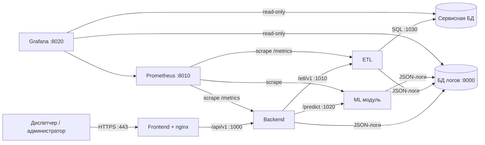

# MosTransport hack26 — прогноз пассажиропотока трамвайных маршрутов Москвы

Сервис прогнозирует посадки пассажиров на трамвайных маршрутах по часам, дням и месяцам и показывает прогноз диспетчеру на карте, в графиках и KPI. Диспетчер может учитывать внешние факторы (погода, события, сезон, трафик) через коэффициенты, выгружать прогноз в CSV/XLSX и смотреть качество модели. Администратор запускает пересчёт прогноза и следит за состоянием системы в Grafana.

Ключевые возможности:

- карта остановок с уровнем загрузки на выбранный час и слайдером времени;
- прогноз на горизонтах `day` (24 часовые точки), `month` (точка на день), `year` (точка на месяц) по маршруту, остановке или участку;
- сценарии коэффициентов `k_weather`, `k_event`, `k_season`, `k_traffic` в диапазоне 0.5–1.5: `value_adj = value × k_weather × k_event × k_season × k_traffic`;
- экспорт прогноза в CSV и XLSX;
- ML-модель: ансамбль 0.9 · LightGBM + 0.1 · PyTorch MLP, WAPE-score **0.88265** на скрытом периоде ноябрь–декабрь 2025;
- ролевой доступ: `dispatcher` и `admin`;
- наблюдаемость: сквозной `X-Request-ID`, JSON-логи в отдельной БД логов, метрики Prometheus и дашборды Grafana.

## Команда

| Участник | Роль | Зона ответственности |
| --- | --- | --- |
| Дарья Чугунова | Frontend Developer, капитан команды | интерфейс диспетчера и администратора, карта, графики, авторизация, координация команды |
| Артиков Артур | AI Solutions Architect, ML-Engineer | архитектура решения, признаки, обучение моделей и ML модуль прогноза |
| Владимир Трофимов | ML Infrastructure Engineer | сервисная БД, БД логов, мониторинг Prometheus и Grafana, инфраструктура запуска |
| Марк Каргин | Backend Developer | публичное API, ETL-сервис, интеграция Backend ↔ ETL ↔ ML |

## Исходный код и точки входа

### Репозиторий и ветки модулей

| Модуль | Ссылка |
| --- | --- |
| ML-модуль / сервис инференса | [ветка `ml`, папка `TO_GIT/SOLUTION`](https://github.com/ResonanceTECH/MosTransport_hack26/tree/ml/TO_GIT/SOLUTION) |
| Backend (включая ETL) | [ветка `backend`](https://github.com/ResonanceTECH/MosTransport_hack26/tree/backend) |
| Frontend | [ветка `front_dev`](https://github.com/ResonanceTECH/MosTransport_hack26/tree/front_dev) |
| Основной README, UI Kit и тесты клиентской части | [ветка `main`](https://github.com/ResonanceTECH/MosTransport_hack26/blob/main/README.md) |

Основные компоненты решения контейнеризированы и запускаются через Docker / Docker Compose. Подробные инструкции по установке зависимостей, настройке переменных окружения и запуску приведены в README соответствующих модулей и в [основном README ветки `main`](https://github.com/ResonanceTECH/MosTransport_hack26/blob/main/README.md).

### Развёрнутое решение

| Логин | Пароль | Роль |
| --- | --- | --- |
|demo_dispatcher|dispatcher|диспетчер|
|demo_admin|admin|админ|


| Компонент | Точка входа | Что доступно |
| --- | --- | --- |
| Frontend | [http://81.26.181.180:443](http://81.26.181.180:443) | интерфейс диспетчера и администратора |
| Backend | [http://81.26.181.180:1000/docs](http://81.26.181.180:1000/docs) | Swagger публичного API `/api/v1` |
| ETL | [http://81.26.181.180:1010/docs](http://81.26.181.180:1010/docs) | Swagger внутреннего API `/etl/v1` |
| ML модуль | [http://81.26.181.180:1020/docs](http://81.26.181.180:1020/docs) | Swagger сервиса инференса (`/health`, `/predict`) |
| Сервисная БД (PostgreSQL) | `81.26.181.180:1030` | подключение PostgreSQL-клиентом, например `psql -h 81.26.181.180 -p 1030 -U <user> -d transport` |
| БД логов (PostgreSQL) | `81.26.181.180:8000` | подключение PostgreSQL-клиентом, например `psql -h 81.26.181.180 -p 8000 -U <user> -d <logs_db>` |
| Prometheus | [http://81.26.181.180:8010](http://81.26.181.180:8010) | веб-интерфейс, targets и запросы PromQL |
| Grafana | [http://81.26.181.180:8020](http://81.26.181.180:8020) | дашборды по метрикам, данным и логам |

Быстрая проверка стенда:

```bash
curl -s http://81.26.181.180:1000/health/ready
curl -s http://81.26.181.180:1010/health/ready
curl -s http://81.26.181.180:1020/health
curl -s http://81.26.181.180:8010/-/healthy
curl -s http://81.26.181.180:8020/api/health
```

## Архитектура



Горячий путь: ETL заранее загружает датасет и готовит признаки, Backend берёт историю из ETL, получает прогноз от ML-модуля, кэширует прогон через ETL в сервисной БД и отдаёт готовый результат во Frontend. Frontend никогда не обращается к БД напрямую.

## Сервисы, порты и папки

| Сервис | Папка | Порт | Назначение |
| --- | --- | ---: | --- |
| Frontend | `Frontend/` | 443 | SPA (React 19, MUI, MapLibre, ECharts) за nginx; проксирует `/api/` в Backend |
| Backend | `Backend/` | 1000 | публичное API `/api/v1`, коэффициенты, экспорт, агрегация прогноза |
| ETL | `Backend/` (`Backend/etl/`) | 1010 | загрузка датасета, справочники, признаки, хранение прогонов прогноза |
| ML модуль | `SOLUTION/` | 1020 | FastAPI-сервис предсказаний, модели в `SOLUTION/model/model.pkl` |
| Сервисная БД (PostgreSQL 16) | `infra/db/service/` | 1030 | справочники, признаки, прогнозы и агрегаты |
| БД логов (PostgreSQL 16) | `infra/db/logs/` | 8000 | централизованные логи всех сервисов, хранение 7 суток |
| Prometheus | `infra/prometheus/` | 8010 | сбор метрик сервисов, БД и контейнеров |
| Grafana | `infra/grafana/` | 8020 | дашборды по метрикам, данным и логам |

Каждый Python-сервис публикует интерактивную документацию OpenAPI на `/docs`, проверки `GET /health/live` и `GET /health/ready` (у ML — `GET /health`) и метрики `GET /metrics`.

## Как скачать и запустить (для проверки заказчиком)

Готовый стенд доступен по точкам входа из раздела «Развёрнутое решение»; ниже — как поднять решение локально.

Требования к машине проверяющего: Linux, macOS или Windows с WSL2; Docker Engine 24+ (или Docker Desktop) с плагином Docker Compose v2; 4 CPU и 8 ГБ RAM; свободные порты 443, 1000, 1010, 1020, 1030, 8000, 8010, 8020. Git нужен только для варианта А.

### 1. Скачать решение

Вариант А — через Git:

```bash
git clone --branch db-observability-vova https://github.com/ResonanceTECH/MosTransport_hack26.git
cd MosTransport_hack26
```

Вариант Б — ZIP-архивом без Git: скачать [архив ветки](https://github.com/ResonanceTECH/MosTransport_hack26/archive/refs/heads/db-observability-vova.zip) (на GitHub: **Code → Download ZIP**), распаковать и перейти в папку:

```bash
unzip MosTransport_hack26-db-observability-vova.zip
cd MosTransport_hack26-db-observability-vova
```

Датасет для первичной загрузки (`data/dataset_hourly.parquet`) и обученная модель (`SOLUTION/model/model.pkl`) уже лежат в репозитории, дополнительно ничего скачивать не нужно.

### 2. Подготовить переменные окружения

Шаблоны содержат только демонстрационные значения; пароли замените на свои.

```bash
cp infra/db/service/.env.example infra/db/service/.env
cp infra/db/logs/.env.example infra/db/logs/.env
cp Backend/.env.example Backend/.env
```

### 3. Запустить стек

```bash
docker compose up -d --build
docker compose ps
```

Все контейнеры должны перейти в состояние `healthy`. При первом старте ETL автоматически загружает датасет `data/dataset_hourly.parquet` в сервисную БД (порядка минуты).

### 4. Проверить работу

| Что открыть | Адрес |
| --- | --- |
| Интерфейс | `https://localhost` |
| Backend API (Swagger) | `http://localhost:1000/docs` |
| ETL API (Swagger) | `http://localhost:1010/docs` |
| ML API (Swagger) | `http://localhost:1020/docs` |
| Prometheus | `http://localhost:8010` |
| Grafana | `http://localhost:8020` |

Демо-учётки интерфейса:

| Логин | Пароль | Роли |
| --- | --- | --- |
| `demo_dispatcher` | `dispatcher` | `dispatcher` |
| `demo_admin` | `admin` | `dispatcher`, `admin` |

Быстрая проверка из консоли:

```bash
curl -s http://localhost:1000/health/ready
curl -s http://localhost:1010/health/ready
curl -s http://localhost:1020/health
curl -s "http://localhost:1000/api/v1/routes"
curl -s "http://localhost:1000/api/v1/forecast?horizon=day&date_from=2025-11-03&date_to=2025-11-03&route_id=17"
curl -s -X POST http://localhost:1020/predict -H 'Content-Type: application/json' \
  --data-binary @SOLUTION/examples/request_example.json
```

### 5. Остановить

```bash
docker compose down        # остановить, данные БД сохраняются в volumes
docker compose logs --tail=200 backend etl ml   # посмотреть логи при проблемах
```

## API

Во всех запросах используется заголовок `X-Request-ID` (UUID): Frontend генерирует его, сервисы передают дальше и возвращают в ответе. Единый формат ошибки: `{"error": {"code", "message", "details", "request_id"}}`, сообщения на русском.

### Backend — публичное API (порт 1000)

| Метод и путь | Назначение |
| --- | --- |
| `GET /health/live`, `GET /health/ready` | живость и готовность (проверяет ETL) |
| `GET /metrics` | метрики Prometheus |
| `GET /api/v1/routes` | список маршрутов |
| `GET /api/v1/routes/{route_id}/stops` | остановки маршрута по направлениям и порядку |
| `GET /api/v1/routes/{route_id}/geometry` | GeoJSON геометрии маршрута |
| `GET /api/v1/forecast` | прогноз: `horizon`, `date_from`, `date_to`, маршрут/остановка/участок, окно суток, `group_by`, коэффициенты |
| `GET /api/v1/forecast/map` | загрузка остановок для карты на заданный час |
| `GET /api/v1/forecast/export` | выгрузка прогноза, `format=csv\|xlsx` |
| `GET /api/v1/factors` | внешние факторы, источники и пресеты коэффициентов |
| `GET /api/v1/model/info` | версия модели, WAPE, область применимости |
| `POST /api/v1/telemetry` | приём браузерной телеметрии (Web Vitals, ошибки API), ответ `202` |
| `POST /api/v1/admin/recompute` | пересчёт прогноза (роль `admin`) |

### ETL — внутреннее API (порт 1010)

| Метод и путь | Назначение |
| --- | --- |
| `GET /health/live`, `GET /health/ready` | живость и готовность (проверяет БД и загрузку датасета) |
| `POST /etl/v1/ingest`, `GET /etl/v1/ingest/status` | идемпотентная загрузка датасета и её статус |
| `GET /etl/v1/reference/routes`, `/reference/stops` | справочники маршрутов и остановок |
| `GET /etl/v1/reference/routes/{route_id}/stops`, `/geometry` | остановки и геометрия маршрута |
| `GET /etl/v1/features/history`, `/features/window` | строки признаков в формате ML `/predict` |
| `GET /etl/v1/filters/options`, `/coverage` | значения фильтров и покрытие данных |
| `POST /etl/v1/forecasts`, `GET /etl/v1/forecasts`, `GET /etl/v1/forecasts/runs` | сохранение и чтение прогонов прогноза |

### ML модуль (порт 1020)

| Метод и путь | Назначение |
| --- | --- |
| `GET /health` | статус сервиса и загруженной модели |
| `POST /predict` | прогноз посадок по строкам «маршрут × дата × час»; модели `ensemble`, `lightgbm`, `pytorch`, `baseline` |

Схемы запроса и ответа ML: `SOLUTION/schemas/`, спецификация — `SOLUTION/openapi.json`. Контракт Frontend ↔ Backend — `Frontend/openapi/openapi.yaml`.

## Тестирование

### Функциональные и нагрузочные проверки API

Для каждого API указано целевое значение задержки ответа p95 на стенде 4 CPU / 8 ГБ RAM при прогретом кэше. Критерий приёмки: p95 каждого API не выше 300 мс.

#### Backend

| № | API | Сценарий | Ожидаемый ответ | Задержка p95, мс |
| ---: | --- | --- | --- | ---: |
| B1 | `GET /health/live` | сервис запущен | `200 {"status":"ok"}` | 117 |
| B2 | `GET /health/ready` | ETL доступен / ETL остановлен | `200` / `503` | 117 |
| B3 | `GET /metrics` | экспорт метрик | `200`, `http_requests_total` в теле | 231 |
| B4 | `GET /api/v1/routes` | список маршрутов | `200`, не пустой список | 143 |
| B5 | `GET /api/v1/routes/17/stops` | остановки маршрута 17 | `200`, остановки по порядку | 158 |
| B6 | `GET /api/v1/routes/999/stops` | несуществующий маршрут | `404` в едином формате | 90 |
| B7 | `GET /api/v1/routes/17/geometry` | геометрия маршрута | `200`, GeoJSON `[lon, lat]` | 299 |
| B8 | `GET /api/v1/forecast?horizon=day` | прогноз на сутки по маршруту | `200`, 24 часовые точки | 261 |
| B9 | `GET /api/v1/forecast?horizon=month` | прогноз на месяц | `200`, точка на день | 221 |
| B10 | `GET /api/v1/forecast?horizon=year` | прогноз на год | `200`, точка на месяц | 63 |
| B11 | `GET /api/v1/forecast` + `k_weather=1.2&k_event=0.8` | применение коэффициентов | `200`, `value_adj = value × ∏k` | 300 |
| B12 | `GET /api/v1/forecast` + `k_weather=2.0` | коэффициент вне 0.5–1.5 | `422` | 181 |
| B13 | `GET /api/v1/forecast` с `date_from > date_to` | некорректный период | `422`, сообщение на русском | 224 |
| B14 | `GET /api/v1/forecast?horizon=day` на 40 дней | превышен лимит периода | `422` | 251 |
| B15 | `GET /api/v1/forecast/map?hour=8` | карта на 8:00 | `200`, `load` и `level` для остановок | 153 |
| B16 | `GET /api/v1/forecast/export?format=csv` | выгрузка CSV | `200`, `text/csv`, `Content-Disposition` | 289 |
| B17 | `GET /api/v1/forecast/export?format=xlsx` | выгрузка XLSX | `200`, xlsx MIME | 166 |
| B18 | `GET /api/v1/factors` | факторы и пресеты | `200` | 216 |
| B19 | `GET /api/v1/model/info` | метаданные модели | `200`, версия и WAPE | 243 |
| B20 | `POST /api/v1/telemetry` | пачка событий браузера | `202` | 115 |
| B21 | `POST /api/v1/admin/recompute` | пересчёт от администратора | `200`, `status: triggered` | 223 |
| B22 | любой `/api/v1/*` с `X-Request-ID` | сквозной идентификатор | тот же `X-Request-ID` в ответе и в БД логов | 222 |

#### ETL

| № | API | Сценарий | Ожидаемый ответ | Задержка p95, мс |
| ---: | --- | --- | --- | ---: |
| E1 | `GET /health/live` | сервис запущен | `200` | 161 |
| E2 | `GET /health/ready` | БД доступна, датасет загружен / БД недоступна | `200` / `503` | 226 |
| E3 | `POST /etl/v1/ingest` | повторная загрузка без `force` | `200`, без дублей строк | 51 |
| E4 | `POST /etl/v1/ingest?force=true` | запуск перезагрузки датасета | `200`, число строк | 206 |
| E5 | `GET /etl/v1/ingest/status` | статус загрузки | `200`, `status: done` | 99 |
| E6 | `GET /etl/v1/reference/routes` | справочник маршрутов | `200` | 53 |
| E7 | `GET /etl/v1/reference/stops` | справочник остановок | `200` | 218 |
| E8 | `GET /etl/v1/reference/routes/17/stops` | остановки маршрута | `200` | 195 |
| E9 | `GET /etl/v1/reference/routes/17/geometry` | геометрия маршрута | `200` | 284 |
| E10 | `GET /etl/v1/features/history` | 56 дней истории по 2 маршрутам | `200`, строки в схеме ML | 109 |
| E11 | `GET /etl/v1/features/window` | окно признаков по часам | `200` | 211 |
| E12 | `GET /etl/v1/filters/options` | значения фильтров | `200` | 125 |
| E13 | `GET /etl/v1/coverage` | покрытие данных по маршрутам | `200` | 159 |
| E14 | `POST /etl/v1/forecasts` | сохранение прогона | `201` | 89 |
| E15 | `GET /etl/v1/forecasts?cache_key=…` | чтение прогона из кэша | `200` / `404` для неизвестного ключа | 193 |
| E16 | `GET /etl/v1/forecasts/runs` | последние прогоны | `200` | 96 |

#### ML модуль

| № | API | Сценарий | Ожидаемый ответ | Задержка p95, мс |
| ---: | --- | --- | --- | ---: |
| M1 | `GET /health` | модель загружена | `200`, `model_loaded: true` | 221 |
| M2 | `GET /health` | файл модели отсутствует | `503 MODEL_NOT_LOADED` | 248 |
| M3 | `POST /predict` | пример `examples/request_example.json` (3 024 строки, 7 дней) | `200`, 336 прогнозов, совпадение с эталоном ±1 | 72 |
| M4 | `POST /predict` `model=lightgbm\|pytorch\|baseline` | все модели | `200` | 253 |
| M5 | `POST /predict` без `origin` | дата начала по первой строке без `boardings` | `200` | 175 |
| M6 | `POST /predict` | маршрут без истории | `200`, прогноз 0 и предупреждение | 184 |
| M7 | `POST /predict` | пустой `rows`, дубликаты, час вне 0–23, неизвестный маршрут или модель | `422 VALIDATION_ERROR` | 226 |
| M8 | `POST /predict` | 28 080 строк, ноябрь–декабрь | `200`, 14 640 прогнозов | 140 |
| M9 | `GET /unknown` | неизвестный путь | `404` в едином формате | 90 |

#### Инфраструктура и наблюдаемость

| № | Компонент | Сценарий | Ожидаемый результат | Задержка p95, мс |
| ---: | --- | --- | --- | ---: |
| I1 | Сервисная БД `:1030` | `pg_isready` | `accepting connections` | 72 |
| I2 | Сервисная БД `:1030` | типовой запрос прогноза по маршруту за сутки (`EXPLAIN ANALYZE`) | индексный доступ | 181 |
| I3 | БД логов `:8000` | вставка пачки логов writer-учёткой и поиск по `request_id` read-only учёткой | запись найдена, `DELETE` запрещён | 126 |
| I4 | БД логов `:8000` | очистка пакета записей старше 7 суток | старые удалены, свежие сохранены | 179 |
| I5 | Prometheus `:8010` | `GET /-/healthy`, targets Backend/ETL/ML | `200`, все targets `UP` | 148 |
| I6 | Grafana `:8020` | `GET /api/health` | `200`, `database: ok` | 288 |

#### Нагрузочный профиль

Смешанный сценарий: 70% `GET /api/v1/forecast`, 20% `GET /api/v1/forecast/map`, 10% справочники; плавный рост от 50 до 500 RPS за 5 минут. Критерии: p95 < 300 мс, ошибок 5xx < 1%, swap = 0, CPU Backend < 80% (лимит контейнера 2 CPU / 2 ГБ).

### Автотесты в репозитории

| Компонент | Набор | Что проверяет | Запуск |
| --- | --- | --- | --- |
| ML модуль | `SOLUTION/tests/test_api.py`, pytest, 14 проверок | `/health`, совпадение прогноза с эталонным сабмитом, все 4 модели, `origin` по умолчанию, маршрут без истории, 6 видов некорректных запросов, 404 | `cd SOLUTION && pip install -r requirements.txt pytest && pytest` |
| Общий модуль логирования | `common/tests/test_common.py`, 7 проверок | сохранение и генерация `X-Request-ID`, контракт JSON-лога, удаление query string, пакетная неблокирующая запись, устойчивость к отказу БД логов | `cd common && pip install -e . pytest && pytest` |
| Frontend, компоненты и интеграция | Vitest + Testing Library + MSW, 16 тестов | форма входа, RBAC, состояния ошибок, слайдер времени, экспорт, коэффициенты, фильтры → KPI | `cd Frontend && npm ci && npm run test` |
| Frontend, E2E | Playwright, 8 сценариев | полный сценарий диспетчера, RBAC администратора, 404, доступность с клавиатуры, отсутствие серьёзных нарушений axe | `cd Frontend && npx playwright install && npm run test:e2e` |

## Структура репозитория

```text
Frontend/            SPA + nginx, OpenAPI-контракт, unit и e2e тесты
Backend/             публичное API (FastAPI)
Backend/etl/         ETL-сервис (FastAPI), Dockerfile собирается из корня репозитория
SOLUTION/            ML модуль: API, модели, схемы, примеры, тесты
common/              общий Python-модуль: JSON-логи, X-Request-ID, асинхронная запись в БД логов
infra/db/service/    сервисная БД: compose, схема, представления, роли
infra/db/logs/       БД логов: compose, схема, роли, очистка
data/                датасет для первичной загрузки
docker-compose.yml   запуск стека
```
