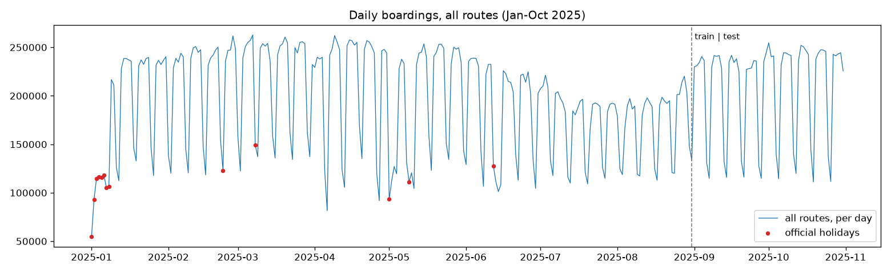
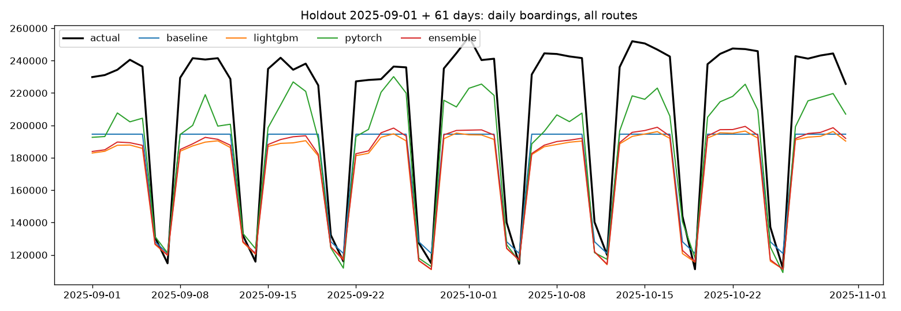
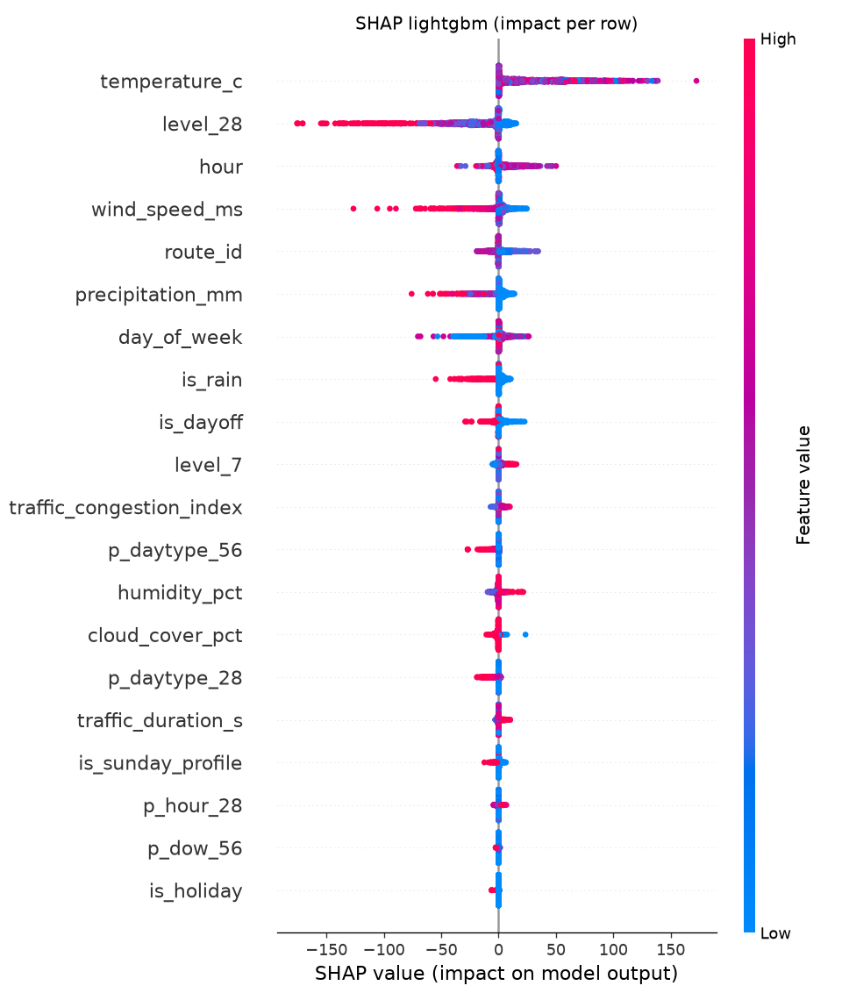
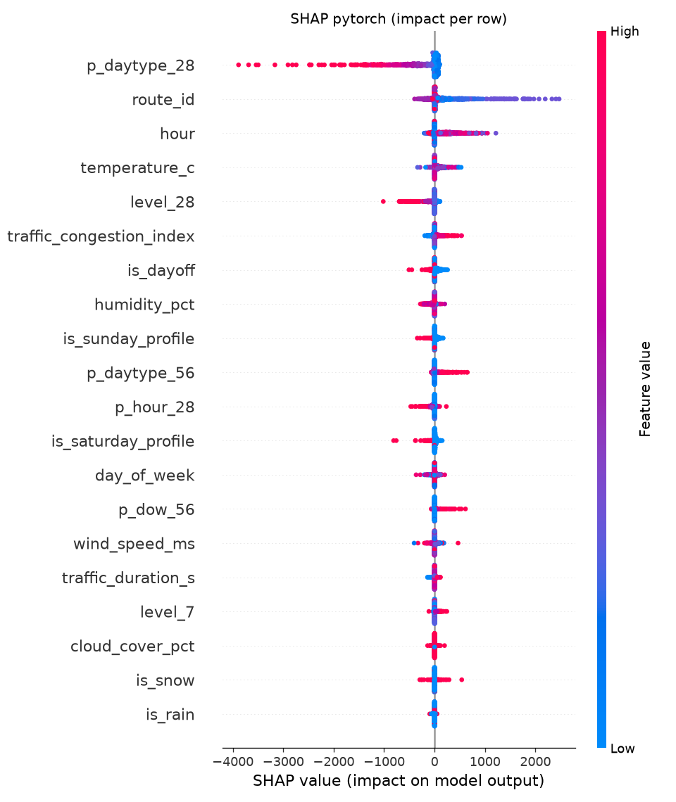

# ML: прогноз посадок на трамвайных маршрутах по часам

Пайплайн обучения и прогноза для задачи хакатона: число посадок (успешных валидаций) на маршруте за час, горизонт — 61 день (2025-11-01 … 2025-12-31), метрика — WAPE-score = max(0, 1 − Σ|y − ŷ| / Σy).

## Итог

**Лучший результат на платформе — 0.88265 (ансамбль 0.9 · LightGBM + 0.1 · PyTorch)**, baseline организаторов — около 0.48.

Журнал сабмитов (`submissions/submissions_log.csv`, `reports/platform_scores.json`):

| Файл | Модель | Локально: сен–окт | Локально: среднее 4 окон | **Платформа: ноя–дек** |
|---|---|---|---|---|
| `submission_ensemble.csv` | ансамбль 0.9 · LightGBM + 0.1 · PyTorch | 0.7800 | 0.8004 | **0.88265** |
| `submission_lightgbm.csv` | LightGBM | 0.7738 | 0.7959 | 0.88226 |
| `submission_pytorch.csv` | PyTorch MLP | 0.8234 | 0.8182 | 0.87022 |
| `submission.csv` | PyTorch MLP (выбор по локальному бэктесту) | 0.8234 | 0.8182 | 0.87022 |
| `submission_baseline.csv` | сезонный профиль | 0.7901 | 0.8017 | не отправлялся |

**Локальная оценка и платформа ранжируют модели наоборот.** На сентябре–октябре лучший PyTorch, на ноябре–декабре — ансамбль и LightGBM. Причина — в данных: сентябрь начинается скачком потока после летнего спада (начало учёбы), а ноябрь–декабрь — спокойное продолжение октября. PyTorch сильнее корректирует недавний профиль и выигрывает на скачке; LightGBM (63 дерева) держится близко к профилю октября и точнее на стабильном периоде. PyTorch к тому же занижает общий уровень ноября–декабря: 12,29 млн посадок против 12,58 млн у LightGBM. Вывод для продакшена: модель по умолчанию — **ансамбль**, а сентябрь–октябрь как единственный отложенный период нерепрезентативен для спокойных месяцев; выбор модели нужно делать по нескольким окнам разных сезонов, когда появится история за год.

Все предикты — формат организаторов `route;date;hour;prediction`, 14 640 строк (10 маршрутов × 61 день × 24 часа), тот же порядок строк, что в `test_submission.csv`, прогнозы — целые числа ≥ 0; проверка по условию пройдена (`submissions/validation.json`). Для сервиса модели упакованы в `model.pkl` командой `train.py export`.

## Структура

```
ML/
├── train.py              CLI пайплайна: prepare, eda, tune, evaluate, final, explain, all
├── config.py             пути, периоды, окна бэктеста, группы признаков
├── data.py               данные из ETL-сервиса -> агрегат маршрут × дата × час, сверка с labels
├── features.py           признаки относительно точки прогноза (без утечек), обучающие окна
├── models.py             baseline, LightGBM, PyTorch MLP, ансамбль: fit / predict / save / load
├── tuning.py             подбор гиперпараметров (Optuna)
├── eda.py                оценка данных
├── explain.py            SHAP для LightGBM и PyTorch
├── submission.py         сборка и проверка сабмита по условию организаторов
├── examples/predict_via_api.py   пример: прогноз диапазона с признаками из ETL API
├── tests/                pytest, 22 теста на синтетических данных
├── fix_lightgbm_macos.sh подключает libomp из PyTorch к LightGBM на macOS без Homebrew
├── requirements.txt
├── artifacts/            модели и гиперпараметры
│   ├── best_params.json
│   ├── lightgbm_final.txt (+ .json с признаками)
│   └── pytorch_final.pt
├── reports/              отчёты
│   ├── metrics.json, model_comparison.csv, holdout_by_route.csv, holdout_by_week.csv, ablation.csv
│   ├── tuning_lightgbm.csv, tuning_pytorch.csv — все попытки Optuna
│   ├── holdout_daily.png, holdout_predictions.parquet
│   ├── eda/   — оценка данных (графики + eda_summary.json)
│   └── shap/  — SHAP (графики + таблицы важности)
├── submissions/          предикты в формате сабмита + validation.json
└── data/                 агрегированный датасет (не коммитится, собирается командой prepare)
```

## Запуск

```bash
cd ML
python3.12 -m venv venv
venv/bin/pip install -r requirements.txt
./fix_lightgbm_macos.sh           # только macOS без Homebrew (иначе: brew install libomp)

venv/bin/python train.py all      # весь пайплайн, около 30 минут на M-серии
venv/bin/python -m pytest         # тесты, 5 секунд
```

По шагам:

| Команда | Что делает | Время |
|---|---|---|
| `train.py prepare [--source api\|db]` | забирает выборку у ETL-сервиса (`POST /make_data` → `GET /get_data/{id}`, по умолчанию `http://localhost:8000`, переменная `ETL_API_URL`) или напрямую из таблицы `features_hourly` (`--source db`, переменная `DATABASE_URL`); сверяет target с `labels/*.csv`; пишет `data/dataset_hourly.parquet` и `.csv` | 6 с |
| `train.py eda` | оценка данных → `reports/eda/` | 1 с |
| `train.py tune [--lgbm-trials N] [--torch-trials N]` | Optuna на окнах тюнинга → `artifacts/best_params.json`; `0` попыток — оставить найденные ранее | 9 + 9 мин |
| `train.py evaluate` | бэктест 4 окна × 4 модели, выбор веса ансамбля и модели для сабмита, абляция источников | 7 мин |
| `train.py final` | обучение на январе–октябре, прогноз ноября–декабря, сабмиты + проверка | 3 мин |
| `train.py explain` | SHAP для финальных моделей на прогнозном периоде | 10 с |
| `train.py export [--output path]` | упаковывает финальные модели в `model.pkl` для сервиса предсказаний: текст модели LightGBM, веса PyTorch (NumPy), параметры препроцессинга, вес ансамбля, модель по умолчанию (лучшая на платформе), метрики | 5 с |

Датасет организаторов (`test_submission.csv`, `labels/`) нужен для сверки target и сборки сабмита: распакуйте `dataset.zip` в `PIPELINE/dataset/` или укажите путь в `DATASET_DIR` (в git не входит). Агрегированный датасет «маршрут × дата × час» уже лежит в `data/dataset_hourly.parquet` (0,8 МБ), поэтому шаги `eda`, `tune`, `evaluate`, `final`, `explain`, `export` работают без ETL-сервиса; `prepare` нужен только для пересборки данных. Без датасета организаторов тесты сабмита пропускаются, остальные 16 проходят.

## Данные

### Агрегация

Единица прогноза — «маршрут × дата × час», как в `labels/labels_day_*.csv` и `test_submission.csv`. Выборку собирает ETL-сервис: `boardings` = число валидаций с `validation_result = 1` за маршрут, дату и час `tran_date_time`, плюс календарь, погода и загруженность дорог (см. README ETL). Полная сетка: 10 маршрутов × 365 дней 2025 года × 24 часа = 87 600 строк, из них 72 960 с фактом (январь–октябрь) и 14 640 прогнозных (ноябрь–декабрь). Часы без посадок — нули (в labels их просто нет).

Сверка с разметкой организаторов при каждой подготовке данных: **0 расходящихся ячеек**, сумма 59 667 191 посадка совпадает.

### Оценка данных (`reports/eda/`)

| Показатель | Значение |
|---|---|
| строк с фактом | 72 960 |
| доля часов без посадок | 21,1% (в 1–4 часа ночи — 71%) |
| маршрут без посадок | 5 (одна валидация за 10 месяцев) — прогноз 0 |
| самый загруженный маршрут | 17: 14,1 млн посадок, 24% всего потока |
| средний день по городу: будни / суббота / воскресенье и праздники | 230 тыс. / 137 тыс. / 116 тыс. |
| праздник относительно будня | 0,48 |
| пик в будни | 8 часов (второй — 17–18) |
| связь будничного потока с температурой (Спирмен) | −0,53: летом и в тепло пассажиров меньше (отпуска, каникулы) |
| с осадками | −0,24 |
| пропуски во внешних признаках | 0% |

Помесячный средний день: январь 180 тыс. (праздники) → март 217 тыс. → август 171 тыс. (летний спад, −21%) → октябрь 213 тыс. Главная сложность ряда видна на `eda/daily_total.png`: 1 сентября поток скачком возвращается к весеннему уровню, а в обучающих данных до сентября такого перехода нет.



## Постановка и валидация

**Окна прогноза.** Сабмит — прогноз на 61 день вперёд от 1 ноября по данным до 31 октября. Ровно так построено и обучение: у каждого окна есть точка прогноза (origin); признаки из истории считаются только по данным строго до неё, а цель — посадки в следующие 61 день. Обучающая выборка — стопка таких окон с шагом в неделю, начиная с 1 февраля (для финальной модели — 39 окон, 514 тыс. строк). Отсутствие утечек проверяется тестом: изменение данных после точки прогноза не меняет ни одного признака истории.

**Признаки** (25):
- контекст: маршрут, час, день недели (категориальные);
- история до точки прогноза: средние посадки того же маршрута в тот же час и тип дня за 28 и 56 дней (`p_daytype_28`, `p_daytype_56`), в тот же день недели за 56 дней (`p_dow_56`), в тот же час за 28 дней (`p_hour_28`), средний дневной поток маршрута за 7 и 28 дней (`level_7`, `level_28`);
- календарь целевого дня: выходной, праздник, сокращённый день, перенесённый рабочий, профиль субботы / воскресенья;
- погода целевого часа: температура, осадки, снег, ветер, влажность, облачность, дождь / снег (флаги);
- загруженность дорог вдоль маршрута (2ГИС): индекс и время проезда.

**Цель — отношение к сезонному профилю.** Модели предсказывают `boardings / (p_daytype_28 + 1)` с весом строки `p_daytype_28 + 1`. Взвешенная L1 на отношении математически равна L1 на посадках, то есть оптимизируется ровно числитель WAPE (проверяется тестом), но модель учит мультипликативные поправки к недавнему уровню маршрута, а не абсолютный уровень. На первом замере (LightGBM с параметрами по умолчанию, окна с марта) это подняло отложенный период с 0.760 до 0.774.

**Признаки дрейфа убраны.** Номер дня горизонта и тренд «7 дней / 28 дней» позволяли модели выучить сезонный дрейф обучающих окон (спад от весны к лету) и переносить его на сентябрь, где поток растёт. Без них отложенный период лучше (0.774 → 0.789 у того же LightGBM), для ноября–декабря направление дрейфа по данным неизвестно. Признаки остаются в коде (`feature_columns(drift=True)`). Начало обучающих окон с февраля вместо марта добавило зимние примеры: 0.789 → 0.806 у LightGBM и 0.811 → 0.821 у PyTorch на отложенном периоде при −0.007 в июльском окне.

**Схема валидации.**

| Окно (точка прогноза) | Прогноз на | Обучение на окнах до | Роль |
|---|---|---|---|
| 2025-06-01 | июнь–июль | 31 мая | тюнинг гиперпараметров и веса ансамбля |
| 2025-07-01 | июль–август | 30 июня | тюнинг |
| 2025-08-01 | август–сентябрь | 31 июля | только отчёт (задевает отложенный период) |
| **2025-09-01** | **сентябрь–октябрь** | 31 августа | **отложенный период** = test организаторов |

Гиперпараметры подбирались только на окнах тюнинга, прогнозы которых заканчиваются до 1 сентября.

## Модели

| Модель | Описание |
|---|---|
| baseline | `p_daytype_28`: средние посадки того же маршрута, часа и типа дня за 4 недели до точки прогноза |
| LightGBM | градиентный бустинг, цель — отношение к профилю, взвешенная L1; маршрут, час и день недели — категориальные |
| PyTorch MLP | числовые признаки — медианное заполнение и стандартизация, категориальные — one-hot; полносвязная сеть с ReLU и dropout, AdamW, OneCycle LR, взвешенная L1 на отношении |
| ансамбль | взвешенное среднее LightGBM и PyTorch, вес подбирается на окнах тюнинга (получилось 0.9 / 0.1) |

Общие правила прогноза: он не бывает отрицательным; маршрут без посадок за последние 4 недели (маршрут 5) получает 0. Сиды фиксированы, повторное обучение даёт те же предикты.

### Подбор гиперпараметров (Optuna, TPE)

Цель — средний WAPE по двум окнам тюнинга. Все попытки — в `reports/tuning_*.csv`.

| Модель | Пространство поиска | Лучшее | WAPE-score на окнах тюнинга |
|---|---|---|---|
| LightGBM, 10 попыток | learning_rate 0.02–0.12, num_leaves 15–255, min_data_in_leaf 10–400, feature_fraction и bagging_fraction 0.5–1, lambda_l2 0.001–30, objective l1 / huber; число деревьев — лучшая итерация на кривой ошибки окна (до 1000) | lr 0.023, 25 листьев, min_data_in_leaf 11, feature_fraction 0.66, bagging 0.69, lambda_l2 0.016, l1, **63 дерева** | 0.8169 |
| PyTorch, 6 попыток | слои 128-64 / 256-128-64 / 256-256 / 512-256-128, dropout 0–0.3, lr 5e-4–5e-3, weight_decay 1e-6–1e-2, эпохи 10–40, batch 512–2048 | 512-256-128, dropout 0.16, lr 7.7e-4, weight_decay 7.6e-3, 35 эпох, batch 512 | 0.8029 |

У LightGBM лучшая итерация на кривой ошибки маленькая: в июньском окне модель, обученная на весне, не может знать о летнем спаде, и каждое следующее дерево ухудшает прогноз. Сначала использовался ранний останов с терпением 50 итераций, он остановил обучение на 15 деревьях — с L1 ошибка на проверке первые десятки итераций почти не меняется. Поэтому модель учится все итерации и берётся минимум кривой.

## Сравнение моделей

WAPE-score, прогноз на 61 день от точки прогноза (`reports/model_comparison.csv`):

| Модель | 06-01 | 07-01 | 08-01 | **09-01 (отложенный)** | среднее тюнинг | среднее все |
|---|---|---|---|---|---|---|
| baseline | 0.8018 | 0.8120 | 0.8030 | 0.7901 | 0.8069 | 0.8017 |
| LightGBM | 0.7938 | 0.8347 | 0.7813 | 0.7738 | 0.8142 | 0.7959 |
| **PyTorch** | 0.7855 | 0.8202 | **0.8436** | **0.8234** | 0.8029 | **0.8182** |
| ансамбль | 0.7941 | **0.8350** | 0.7923 | 0.7800 | **0.8146** | 0.8004 |

Отложенный период по маршрутам (`reports/holdout_by_route.csv`):

| Маршрут | 1 | 7 | 11 | 12 | 17 | 25 | 26 | 28 | 50 |
|---|---|---|---|---|---|---|---|---|---|
| baseline | 0.803 | 0.690 | 0.826 | 0.850 | 0.872 | 0.715 | 0.733 | 0.738 | 0.626 |
| LightGBM | 0.785 | 0.673 | 0.814 | 0.833 | 0.857 | 0.695 | 0.710 | 0.718 | 0.614 |
| **PyTorch** | **0.833** | **0.793** | **0.850** | **0.877** | **0.875** | **0.729** | **0.805** | **0.764** | **0.664** |

По неделям горизонта PyTorch держит 0.79–0.85 от первой до девятой недели (`reports/holdout_by_week.csv`), качество с удалением от точки прогноза почти не падает.



**Выводы.**
- Главная ошибка всех моделей на отложенном периоде — недооценка будней сентября: 1 сентября поток скачком растёт после летнего спада, а в обучающих окнах такого перехода нет. PyTorch ближе всех к факту, LightGBM и ансамбль остаются у уровня августа.
- LightGBM выигрывает у baseline в спокойном июльском окне (0.835 против 0.812), но проигрывает на окнах со сменой сезона. После подбора в нём всего 63 дерева, то есть по сути это baseline с небольшими поправками.
- **Выбор модели для сабмита.** Правило «лучшая на окнах тюнинга» выбрало ансамбль; после того как он проиграл baseline на обоих поздних окнах, правило поменяли на «лучшая по среднему всех четырёх окон» — это PyTorch (0.818), он и ушёл в `submission.csv`. Платформа показала, что первое правило было верным: ансамбль 0.88265 против 0.87022 у PyTorch (см. [Итог](#итог)). Оба поздних окна включают сентябрьский скачок, поэтому смещали выбор в сторону модели, которая лучше ловит резкие переходы, а ноябрь–декабрь стабилен.

### Абляция внешних источников

LightGBM на отложенном периоде, признаки истории + группы источников (`reports/ablation.csv`):

| Вариант | WAPE-score | Прирост |
|---|---|---|
| только история (профили, уровень) | 0.7620 | — |
| + календарь | 0.7618 | −0.0002 |
| + погода | 0.7741 | **+0.0121** |
| + загруженность 2ГИС | 0.7619 | −0.0001 |
| календарь + погода | 0.7740 | +0.0120 |
| все источники | 0.7738 | +0.0118 |

Эффект подтверждён у погоды (+1,2 п.п.). Календарь не даёт прироста: его главная информация (тип дня) уже есть в профиле `p_daytype_28`, а праздников в сентябре–октябре нет — на ноябрь–декабрь (3–4 ноября, 31 декабря) он влияет, это видно по SHAP PyTorch. Загруженность 2ГИС — типичный недельный профиль, одинаковый для всех недель, поэтому к профилю маршрута по часу и типу дня почти ничего не добавляет. Оговорка: на отложенном периоде используется фактическая погода, в эксплуатации была бы прогнозная, поэтому прирост от погоды оценён оптимистично.

## SHAP (`reports/shap/`)

Считается для финальных моделей на прогнозном периоде (ноябрь–декабрь), 2 000 строк для LightGBM и 800 для PyTorch. Модели предсказывают отношение к профилю, поэтому вклады переведены в посадки: вклад × профиль — точное разложение прогноза в пассажирах относительно профиля. LightGBM — TreeSHAP средствами самого LightGBM (`pred_contrib`, корректно для категориальных сплитов); PyTorch — `shap.GradientExplainer` (expected gradients), вклады one-hot колонок суммируются в исходный признак.

Средний |SHAP|, посадок на маршрут-час (`importance_comparison.csv`):

| Признак | LightGBM | PyTorch |
|---|---|---|
| `p_daytype_28` (профиль 4 недели) | 1.1 | **290.5** |
| маршрут | 4.9 | **234.7** |
| час | 5.9 | **177.3** |
| температура | **26.7** | 65.8 |
| `level_28` (уровень маршрута) | 19.1 | 61.2 |
| индекс загруженности 2ГИС | 1.5 | 46.2 |
| выходной день | 2.3 | 42.6 |
| влажность | 1.2 | 35.2 |
| профиль воскресенья | 0.8 | 32.0 |
| ветер | 5.1 | 17.6 |

- **LightGBM** (63 дерева) почти не отклоняется от профиля: крупнейшие поправки — температура и уровень маршрута, в сумме десятки посадок в час.
- **PyTorch** корректирует профиль сильнее и по делу: высокий профиль часа сглаживается (при больших `p_daytype_28` вклад отрицательный — модель не переносит пики последних недель один в один), маршрут и час задают форму суток, выходной и профиль воскресенья снижают прогноз, высокая загруженность дорог — признак часа пик — повышает.

| LightGBM | PyTorch |
|---|---|
|  |  |

## Сабмит и проверка

`train.py final` пишет предикты каждой модели и проверяет каждый файл по условию README организаторов (`submission.validate_submission`):
- заголовок ровно `route;date;hour;prediction`, разделитель `;`;
- 14 640 строк = 10 маршрутов × 61 день × 24 часа, без дубликатов;
- ключи и их порядок совпадают с `test_submission.csv`;
- маршруты `1, 5, 7, 11, 12, 17, 25, 26, 28, 50`, даты `YYYY-MM-DD` от 2025-11-01 до 2025-12-31, часы 0–23;
- прогноз — конечное число ≥ 0 (пишется целым, как округляет проверка).

Результат — `submissions/validation.json`, все файлы валидны. Правдоподобие `submission.csv`:

| Маршрут | 1 | 7 | 11 | 12 | 17 | 25 | 26 | 28 | 50 |
|---|---|---|---|---|---|---|---|---|---|
| факт октября, посадок в день | 19 009 | 22 615 | 30 839 | 32 568 | 51 321 | 8 095 | 18 154 | 10 483 | 20 038 |
| наш прогноз ноября–декабря, в день | 18 009 | 21 724 | 29 659 | 31 240 | 47 754 | 7 551 | 17 438 | 9 738 | 18 358 |

Прогноз в среднем на 4–8% ниже октября: в ноябре–декабре больше нерабочих дней (3–4 ноября, 31 декабря). Праздник 4 ноября прогнозируется на уровне воскресенья (104 тыс. посадок против 244 тыс. в среду 5 ноября), маршрут 5 — нули, суточный профиль с пиками в 8 и 17–18 часов сохраняется.

## Тесты

`venv/bin/python -m pytest` — 22 теста на синтетических данных (без БД и сети), 5 секунд:

| Файл | Что проверяет |
|---|---|
| `test_metrics.py` | WAPE и WAPE-score: идеальный прогноз, известное значение, обрезка на нуле, нулевой факт |
| `test_features.py` | окно покрывает горизонт; **признаки истории не зависят от данных после точки прогноза**; профиль равен ручному расчёту; в обучении нет целей после конца периода; признаки дрейфа выключаются |
| `test_models.py` | взвешенная L1 на отношении равна L1 на посадках; baseline, LightGBM и PyTorch учатся (WAPE-score > 0.5), прогноз ≥ 0, маршрут без истории — 0; сохранение и загрузка дают те же предикты; ансамбль — взвешенное среднее |
| `test_submission.py` | сабмит в порядке эталона и валиден; ловятся отрицательные прогнозы, пропущенная строка, неверный заголовок, неверный порядок, отсутствие прогноза для ключа |

## Пример пайплайна через ETL API

Прогноз произвольного диапазона после последнего дня с фактом сохранёнными моделями; признаки берутся у ETL-сервиса (`POST /make_data` за диапазон + 56 дней истории, затем `GET /get_data/{id}`):

```bash
venv/bin/python examples/predict_via_api.py --date-from 2025-11-01 --date-to 2025-11-07 --routes 1 17
```

Скрипт печатает дневные суммы по маршрутам и пишет почасовой прогноз обеих моделей в `submissions/example_<даты>.csv`.

## Ограничения и что улучшить

- 10 месяцев истории не содержат ни одного ноября–декабря: сезонный переход в прогнозный период модели оценивают по недавнему уровню, погоде и календарю, а не по прошлому году.
- Переход «лето → сентябрь» не повторяется в обучении, из-за этого все модели недооценивают начало сентября; для ноября–декабря аналогичный риск — предновогодняя неделя.
- Погода за прогнозный период — фактическая (архив Open-Meteo): в эксплуатации её заменит прогноз, и качество будет чуть ниже.
- Что попробовать: школьные каникулы и учебный календарь как признак; обучение на отношении к профилю того же дня недели; квантильная калибровка уровня по последней неделе; ансамбль PyTorch с разными сидами.
